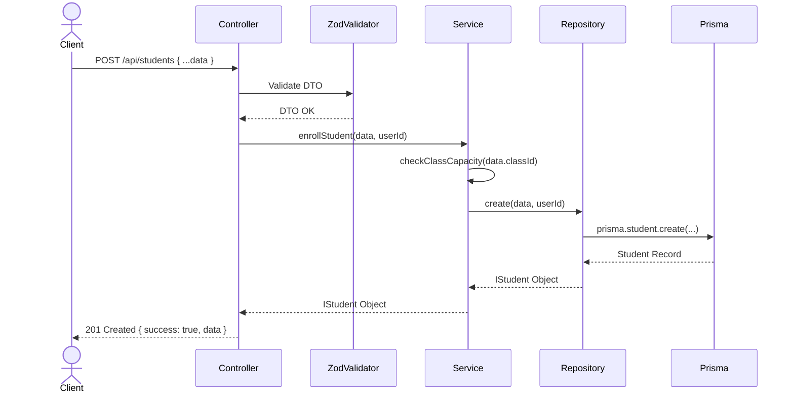
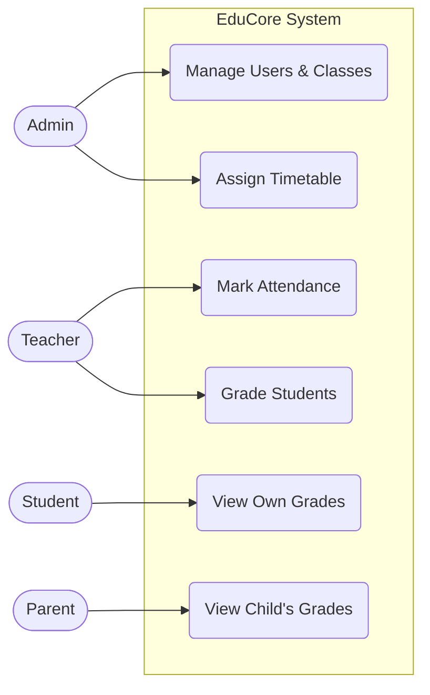

# EduCore Architecture

This document describes the high-level architecture, design patterns, and UML diagrams for the EduCore School Management System.

## Architectural Patterns
EduCore uses a strict **Layered Architecture** leveraging the **MVC + Repository + Service** patterns.

- **Controllers**: Thin wrappers that only handle HTTP requests, responses, and routing. They receive validated DTOs and call the appropriate service.
- **Services**: The core of the application. All business logic lives here (e.g., Timetable Conflict Detection, Password Hashing, Capacity checks).
- **Repositories**: Data Access Layer. This is the **only** layer allowed to interact with the Prisma ORM.

## Diagrams

### 1. Entity Relationship Diagram (ERD)
The database is fully normalized in PostgreSQL.

```mermaid
erDiagram
    User ||--o| Student : "has"
    User ||--o| Teacher : "has"
    User ||--o| Parent : "has"
    
    Student ||--o{ Attendance : "logs"
    Student ||--o{ Grade : "receives"
    
    Class ||--o{ Student : "contains"
    Class ||--o{ TeacherOnClass : "taught by"
    Teacher ||--o{ TeacherOnClass : "teaches"
    
    Class ||--o{ Timetable : "has schedule"
    Teacher ||--o{ Timetable : "assigned to"
```

### 2. Enrollment Sequence Diagram


### 3. Use Case Diagram

